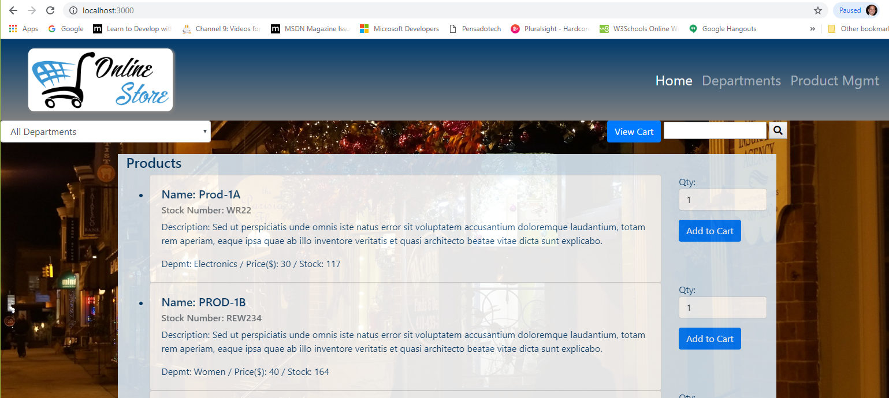
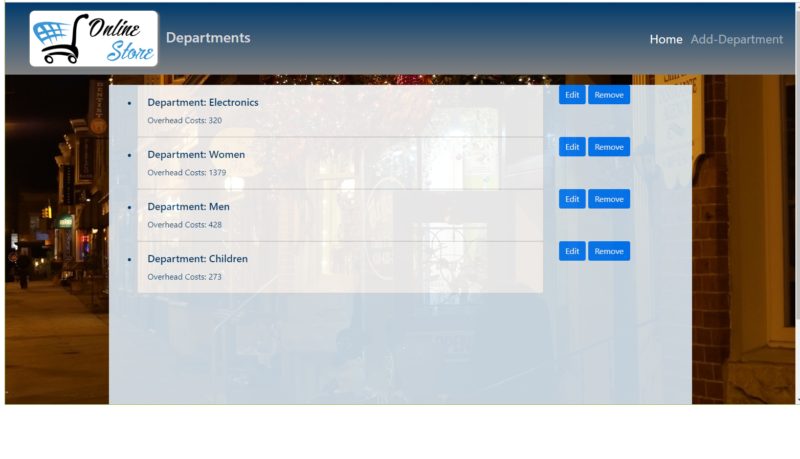
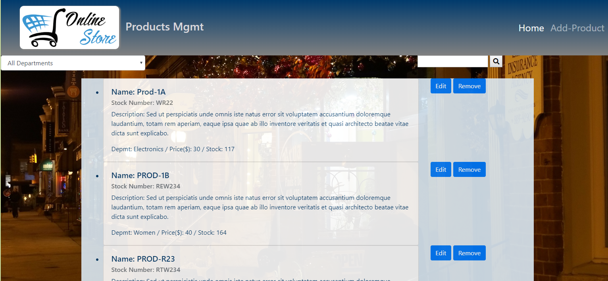
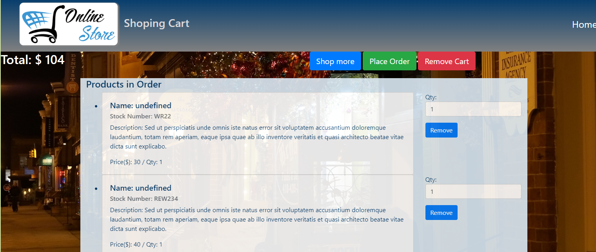
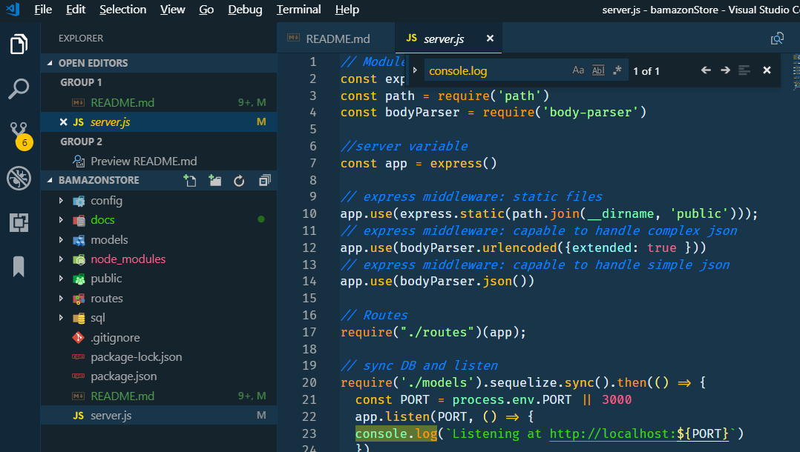

# bamazon

By Armando Pensado 

## Description

The application is a pretend online store. The application was made using Node JS, sequlize (ORM), and mysql2 libraries. The application uses a MySql database. 

The application includes html and API routes to work with the screen, adding department and products, and present an available product list in the store front. The user can select the items and quantity, adding them into a shopping cart. 

After selecting the desired products, the user can view the shopping cart, can decide to put the order, return to shop for additional items, and simply remove the shopping cart.



# How does it work

The application shows an empty store. The user needs to enter several departments, and after that, products. Each product will be associated with a department. The system will not allow to enter products unless, at least one department exist.

Having departments and products, the main page, which is the store, will present the possible products to select. The user can filter the products by department, and by selecting the desired quantity can add the product to the shopping cart.

Having all desired products in the shopping cart, the user can hit the button “View Cart”, as a wau to proceed to check out. In here the customer can remove items, and place the order.

The following images provide a glance to the application.

#### Store


#### Departments


#### Products


#### Shoping Cart


## Who can benefit from this application

This application is beneficial for NodeJS developer, providing sample programming structures using JavaScript, and using **Express**, **MySql**, **seqelize (ORM)**, and custom-made modules that encapsulate the logic to access teh database.


## How developers can get started

To start, the developer must have NodeJS installed in the computer. After, that the project can be cloned and initialized.  Here are the steps for getting started.

1. Install NodeJS into the computer  (https://nodejs.org/en/). Download button and run through the installation file.

2. Clone or Fork the project into the computer.

3. In the folder project, Make a `.gitignore` file using https://www.gitignore.io/, selecting the key words for teh OS, node, and visual code (e.g. Windows, visual code, node). This will tell git not to track these files specified in the contents, and thus they won't be committed to Github.


5. Bring all external module dependencies using the command:


```js
node i
```

After, the initialization, and using Microsoft Visual Code, the project folder should resemble as depicted below, and should be ready for execution.

5.vcode.png

